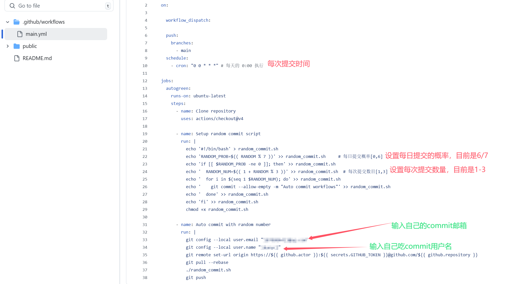

# github自动提交

## 利用github工作流，实现自动提交github项目，帮你点亮你的github一片绿
- 每天定时自动运行，按照设置的时间（如每天美国时间凌晨 0:00）执行。
- 根据随机概率控制提交（0-6 的概率），如果需要提交，则随机生成 1-3 个空提交（empty commit），并将其推送到 GitHub 仓库。
- 通过定时提交保持仓库的活跃度，让贡献图（GitHub Contributions Graph）不断更新。

## 使用方法
1. 把我的仓库fork到你自己的github项目，随便取个名字
2. 配置操作权限
3. 配置读取和写入权限
4. 配置**提交者用户名和邮箱**(！！！非常重要),前往.github/workflows/main.yml配置 
5. 提交一次修改，看看是否成功

> [!CAUTION] 
>提交者的**邮箱**和**账号**必须配置成自己的，不然无法成功统计commit，别到时候给别人提交commit了</p>
>邮箱地址可以填你**github绑定的邮箱地址**</p>
>也可以填你的**私密邮箱**

## 如何设置**私密邮箱**

要隐藏你的电子邮件，可以通过 GitHub 的用户名设置一个 `noreply` 邮箱地址，这样就可以保护你的真实电子邮件地址。GitHub 提供了一个类似 `username@users.noreply.github.com` 的邮箱，你可以在 GitHub 的邮箱设置中找到并使用这个邮箱。

具体的步骤如下：

1. **在 GitHub 设置邮箱**：
   - 登录到 GitHub。
   - 进入 [GitHub Settings](https://github.com/settings/emails)。
   - 在 "Primary email address" 下，启用 "Keep my email address private"（保持我的电子邮件地址私密）。
   - 选择一个类似 `username@users.noreply.github.com` 的邮件地址。

2. **修改 Git 配置**：
   更新你的 Git 配置文件，使用 GitHub 提供的 `noreply` 邮箱地址。你可以在 `workflow` 中的 `git config` 步骤中修改为这个 `noreply` 邮箱：

```yaml
git config --local user.email "your-username@users.noreply.github.com"
git config --local user.name "ikunycj"
```

这样，每次提交时，GitHub 会使用 `noreply` 邮箱来代替你个人的邮箱地址，保证隐私。
